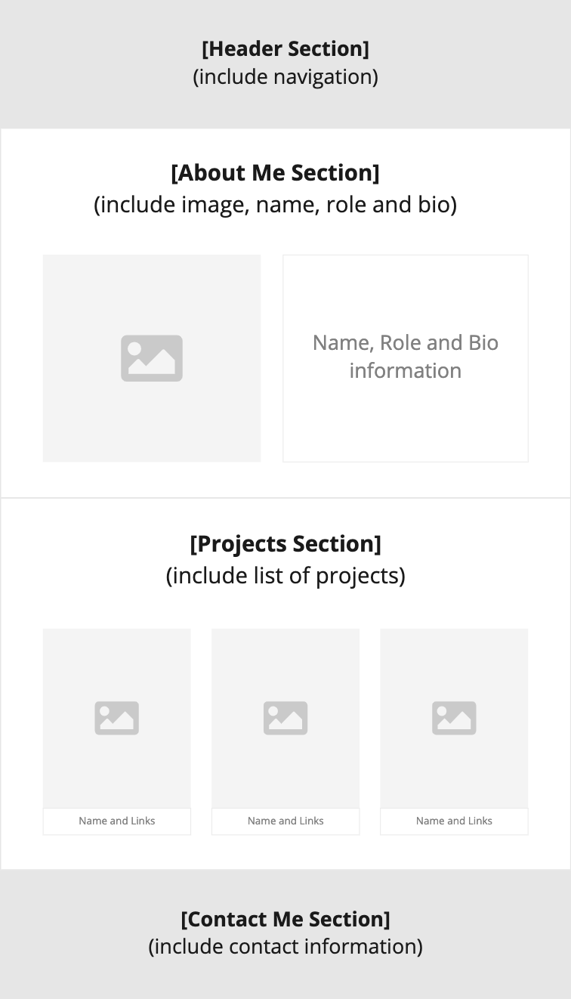

# React Portfolio

## User Story

I want to present my professional react portfolio to potential employers in the field of technology.

## Acceptance Criteria

- As a potential employer I should be able to
  - view your **full name**, **photo**, **job title** you are looking for and a **short biography** in a section about yourself
  - view a list of your **projects** in a projects section where each project must contain an image, a title, link to the source code, and link to the application
  - view your **contact information** in a contact section which contains the following links: **LinkedIn profile**, **GitHub profile**, **email** and **telephone number**
  - navigate through the different sections of the application; About Me (about-me), Projects (projects), and Contact Me (contact-me)

## Technical Criteria

- Ensure that the code follows semantic HTML structure
- Ensure that the code is well structured, using re-useable components
- Ensure the codebase follows the React files and folder structure

## How to get started?

Create a new react app using `create-react-app` and push the app to a new repository on GitHub.

You can use:

- [React Boostrap](https://react-bootstrap.github.io/) as your framework
- choose a colour palette from [coolors](https://coolors.co/)
- [Font Awesome icons](https://fontawesome.com/v5/docs/web/use-with/react) with React.

## Wireframe

**Use your imagination** when building your solution. You can use the following to help guide you how to structure your app.

